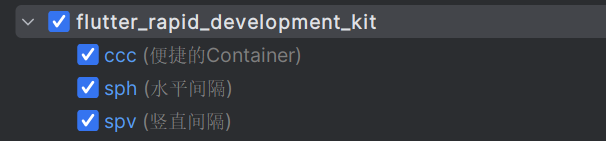

## 使用

### Step 1 导入flutter_rapid_development_kit

```yaml
  flutter_rapid_development_kit:
    git:
      url: "https://github.com/hbolin/flutter_rapid_development_kit"
      ref: "3.0.1"
```
### Step 2 安装GetX插件

安装[my_getx_template](./docs/my_getx_template-3.0.3.jar)插件

### Step 3 配置页面跳转监听

监听页面跳转的回调，例如`didPopNext`；`didPushNext`；`didPush`；`didPop`等。  
需要把`routeObserver`配置到`MaterialApp`上，否则监听路由跳转的方法无法生效。

```dart
MaterialApp(
  navigatorObservers: <RouteObserver<ModalRoute<void>>>[
    routeObserver,
  ],
);
```

### Step 4 配置路由

#### Step 4.1 编写路由类`route_util`

```dart
class RouteUtil {
  static String initialRoute = const IndexPage().getRouteName();

  static final List<GetPage> initialPages = [
    GetPage(
      name: initialRoute,
      page: () => IndexPage.fromRouteParas(Get.parameters),
    ),
    GetPage(
      name: const TestToastUtil2Page().getRouteName(),
      page: () => TestToastUtil2Page.fromRouteParas(Get.parameters),
    ),
  ];
}
```

#### Step 4.2 路由配置到MaterialApp

```dart
MaterialApp(
  initialRoute: RouteUtil.initialRoute,
  getPages: RouteUtil.initialPages,
);
```
### Step 5 使用生成器

#### Step 5.1 [字体资源生成器](example/makers/font_assets_runner.dart)

```dart
import 'package:flutter_rapid_development_kit/flutter_rapid_development_maker.dart';

void main() {
  FontAssetMaker.makeFontAssetToFontClass(
    directoryPath: "assets/fonts",
    targetFile: 'lib/config/app_font_family_asset.dart',
    className: 'AppFontFamilyAsset',
  );
}
```

#### Step 5.2 [图片资源生成器](example/makers/image_assets_runner.dart)

```dart
import 'package:flutter_rapid_development_kit/flutter_rapid_development_maker.dart';

void main() {
  ImageAssetMaker.makeImageAssetToAssetClass(
    directoryPath: "assets/images",
    targetFile: 'lib/config/app_image_asset.dart',
    className: 'AppImageAsset',
  );
}
```

#### Step 5.3 [iconfont资源生成静态类](example/makers/iconfont_assets_runner.dart)

从[iconfont网站](https://www.iconfont.cn/)下载的资源。

```dart
import 'package:flutter_rapid_development_kit/flutter_rapid_development_maker.dart';

void main() {
  IconFontAssetMaker.makeIconFontClass(
    directoryPath: "makers/src/font_2084616_ucedulxxvik",
    targetFile: 'lib/config/icon_font_asset.dart',
    className: 'IconFontAsset',
  );
}
```

### Step 6 目录结构

```
src
│
└───extension
│        date_time_converter.dart
│        list_extensions.dart
│        money_format.dart
│        string_number_converter.dart
│   
└───page
│        base_page.dart
│   
└───util
│        action_util.dart
│        loading_util.dart
│        log_util.dart
│        model_util.dart
│        toast_util.dart
│   
└───widget
         cached_loading_body.dart
         circle_image.dart
         column_row_grid_view.dart
         conditional_widget.dart
         convenient_container.dart
         convenient_rich_text.dart
         image_banner.dart
         ink_well_container.dart
         list_grid_view.dart
         loading_body.dart
         rounded_image.dart
         separated_column.dart
         separated_row.dart
         separated_wrap.dart
         visibility_builder.dart
```

### Step 7 常用快捷键

#### Step 7.1 导入[live_templates](docs/flutter_rapid_development_kit_live_templates.zip)

#### Step 7.2 常用的快捷键


#### Step 7.3 IDEA配置
[settings_0.1.0](docs/settings_0.1.0.zip)