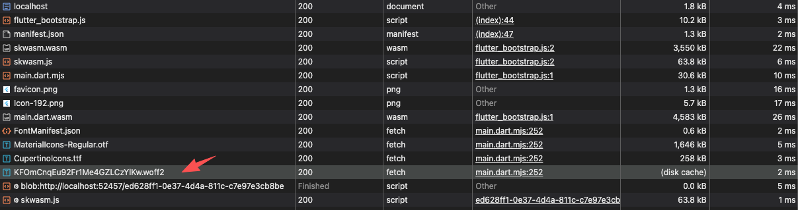

### Step1 运行Flutter空项目

1. 追加参数 `--release --wasm --no-web-resources-cdn` 
2. 参数 `--no-web-resources-cdn` 可以使得一些相关的资源不走 `gstatic.com`



目前字体资源还是走的 `cdn`，字体地址：`https://fonts.gstatic.com/s/roboto/v32/KFOmCnqEu92Fr1Me4GZLCzYlKw.woff2`

### Step2 追加Roboto字体

这是 Flutter Web 引擎的默认硬编码行为。当项目在浏览器启动时，底层渲染器会自动拉取 Roboto 字体来初始化排版。
要阻止这个行为，你需要在项目中显式注册一个同名的本地 Roboto 字体来拦截它。

具体操作步骤：
1.  去 Google Fonts 官网 或者是你报错的那个链接，下载 Roboto-Regular.ttf。
2. 把下载好的 .ttf 文件放入项目，例如放在 assets/fonts/Roboto-Regular.ttf。
3. 打开你的 pubspec.yaml 文件，严格按照以下格式显式声明 Roboto 字体族：
```yaml
flutter:
  fonts:
    - family: Roboto
      fonts:
        - asset: assets/fonts/Roboto-Regular.ttf
```